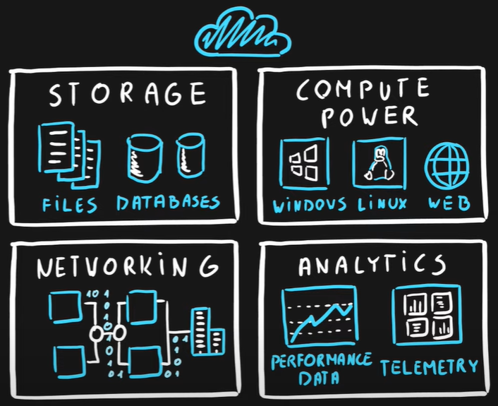

# Part 1: Describe core Azure concepts

## Cloud Computing
Delivery model for services. There four main ones are: 
- Storage
- Compute Power
- Networking
- Analytics
- ... and more services

## Scalability
Scalability is the ability to scale. 

Scaling is a process of
- allocating (adding) resources or
- deallocating (removing) resources

## Elasticity
Elasticity is the ability to scale dynamically

## Agility
Agility is the ability to react quickly. Agility is the ability to allocate and deallocate (scale) resources quickly. 

## Fault Tolerance
Fault tolerance is the ability to remain up and running during component and service failures.
Disaster is a serious disruption of services caused by natural or human-induced causes. 

## Disaster Recovery
Disaster Recovery is the ability to recover from an event that has taken down the service (disaster).

## High Availability
Availability is a measure of system uptime for users/services. High availability is the ability to keep services running for extended periods of time with very little downtime. 