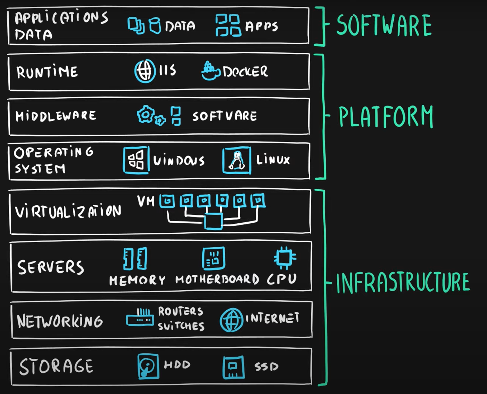
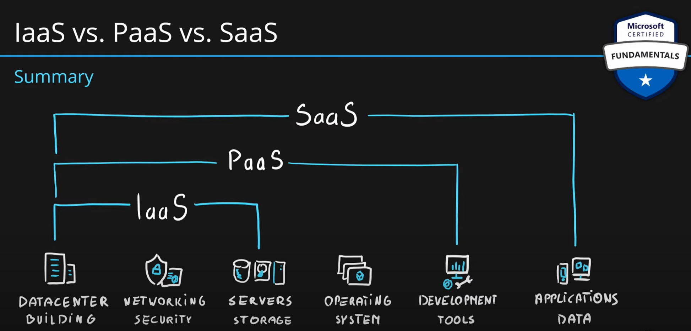

# IaaS vs PaaS vs SaaS cloud service models

As a service means which party will manage the particular layer and all the layers below.

- **Software** layer consists the application (application code and set) & the application data
- **Platform** layer means all the supporting software and the operating system required to host the application
- **Infrastructure** layer consists hardware the infrastructure and virtualization required to host the platform

| Layer | Layer |
|---|---|
|Application|Software|
|Data|Software|
|Runtime|Platform|
|Middleware|Platform|
|Operating System|Platform|
|Virtualization|Infrastructure|
|Servers|Infrastructure|
|Networking|Infrastructure|
|Storage|Infrastructure|

